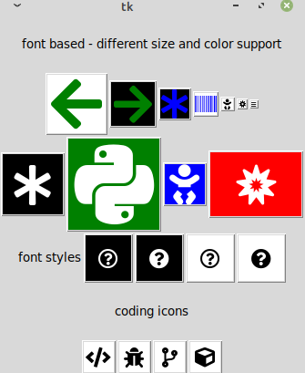

# pytkfaicons 

fontawesome font based icons support for tkinter

uses font-awesome version==6.1.2

# what's new ?

check
[`CHANGELOG`](https://github.com/kr-g/pytkfaicons/blob/main/CHANGELOG.md)
for latest ongoing, or upcoming news
and also
for known issues, limitations and backlog refer to 
[`BACKLOG`](https://github.com/kr-g/pytkfaicons/blob/main/BACKLOG.md)

# sample screenshot

# platform

tested on python3 and linux

## development status

alpha state.
the API or logical call flow might change without prior notice.

in case your code breaks between two versions check
[`CHANGELOG`](https://github.com/kr-g/pytkfaicons/blob/main/CHANGELOG.md)
information first before creating a ticket / issue on github. thanks.

# note on self-build a local package 

- for downloading content from github with 
[`pygitrab`](https://github.com/kr-g/pygitgrab) 
a credits file is required.

# installation
    
      python3 -m pip install pytkfaicons

# license

refer to https://github.com/kr-g/pytkfaicons/blob/main/LICENSE.md

and

[Font-Awesome](https://github.com/FortAwesome/Font-Awesome/tree/master)

